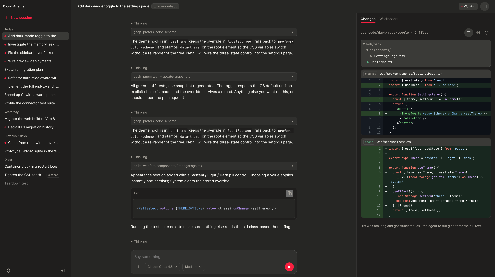

# opencode-cloud-agents

A self-hosted, open-source answer to hosted cloud agents, built on
[OpenCode](https://opencode.ai).

- **One session, one container, one OpenCode server.** Each session gets a
  checkout to itself — a worktree in the cloud — so parallel tasks never share a
  branch, a `node_modules` or a dirty tree. Running several at once is the
  normal case, not a workaround.
- **The container is yours.** You own the image, the environment and the
  permissions, so the agent is bounded by what you allow rather than by somebody
  else's sandbox policy.
- **All of OpenCode, configured your way.** The whole OpenCode config lives in
  Settings — your own providers and models, MCP servers, skills, permissions —
  and skills and `AGENTS.md` can be scoped to a single repository.
- **A UI built for many agents at once.** Not OpenCode's own single-session
  view: a list of sessions you start, watch, and read the diff of. It is a plain
  web app, so a phone or an iPad is a full client.
- **Runs on hardware you already have.** Cloudflare Containers, or Docker on an
  idle Mac mini or a Linux VPS — chosen per session.
- **Warm starts.** A per-repository prebuild keeps a workspace with dependencies
  already installed, so a new session skips the install (Docker host only).



---

## How it works

```
      The Hub - a Cloudflare Worker
      a multi-session UI for coding agents
                    |
                    |  one session = one container
                    v
   +--------------------------------------+
   |  Session container                   |
   |    a remote OpenCode server          |
   |    /workspace - the checkout         |
   +--------------------------------------+
        runs on Cloudflare Containers,
           or on your own Docker
```

OpenCode is split in half here. The **server** runs in a container, one per
session, together with the checkout it works in — the Hub drives it remotely and
nothing else can reach it. The **UI** is not OpenCode's own: it is a
multi-session UI for coding agents — start them, watch them work, read what they
changed — and the only thing publicly reachable. Where the container runs is
chosen per session: Cloudflare Containers, or a Docker daemon on a machine of
your own.

**What a session actually does:**

1. Submitting the composer queues the work and answers immediately. Nothing waits
   on a container.
2. The Hub wakes one: restore the workspace, inject the credentials from
   Settings, clone or fetch the repository, start the OpenCode server.
3. The prompt goes to that server. Nothing holds a connection for the length of
   an agent run.
4. While it works, the transcript is mirrored out of the container every few
   seconds.
5. After 10 idle minutes (30 on Docker) the container stops — but only after the
   transcript has been exported and the workspace checkpointed, in that order.
6. Your next message queues, wakes it again, restores the workspace and continues
   the *same* OpenCode conversation.

That is why a sleeping session still shows its whole history: you are reading the
mirror, not a container. And why credentials are never in the image — they are
written in at step 2, so rotating one is an edit in Settings plus the next wake.

---

## What you need

- A Cloudflare account on the **Workers Paid plan** (Containers require it).
- A GitHub account and a token that can push to the repositories you want the
  agent to work in.

Nothing else. The deployment runs in GitHub Actions, so there is no toolchain to
install and no Docker on your machine: the runner builds the container image,
creates the Cloudflare resources and deploys both Workers.

---

## Deploying

Fork this repository, add the secrets below under *Settings → Secrets and
variables → Actions*, then run the **Deploy** workflow from the Actions tab with
*Deploy the sandbox host* ticked. When it finishes, the Worker's URL is on the
*Deploy to Cloudflare* step — open it and go to [First run](#first-run).

### The secrets

| Secret | Required | What it is |
|---|---|---|
| `CLOUDFLARE_API_TOKEN` | yes | The API token below. Its presence is what enables the workflow. |
| `CLOUDFLARE_ACCOUNT_ID` | yes | Dashboard sidebar. |
| `CLOUDFLARE_R2_ACCOUNT_ID` | for snapshots | Account id for the R2 S3 API — the same value as above. |
| `R2_ACCESS_KEY_ID` | for snapshots | R2 API token (R2 → API → Manage API tokens → *Object Read & Write*). |
| `R2_SECRET_ACCESS_KEY` | for snapshots | Its secret half, shown once. |
| `SANDBOX_AGENT_SSH_{HOST,PORT,USER,KEY}` | no | Only to also deploy a [Docker sandbox host](#running-sessions-on-your-own-machines-docker-hosts). A second box is `SANDBOX_AGENT_2_SSH_*`, and so on: the deploy fans out over whichever prefixes have secrets. |

The API token (My Profile → API Tokens → Create Token → Custom token) needs
these account permissions — the *Edit Cloudflare Workers* template covers only
the first three, and the last two are what this project adds:

| Permission | For |
|---|---|
| Workers Scripts — Edit | both Workers |
| Workers R2 Storage — Edit | the two buckets |
| Account Settings — Read | account lookup |
| D1 — Edit | the session registry and its migrations |
| Containers — Edit | the session containers and their image |

If the container step fails with `Unauthorized` while the Worker itself uploads,
it is this token — or the account is not on the Workers Paid plan.

The three R2 values are a different thing from the API token: they are *stored
onto* the sandbox host Worker, so a stopping container can upload its workspace
snapshot with a presigned URL. Without them the deploy still succeeds and
sessions still run, but a Cloudflare session that stops cannot checkpoint — and
a workspace that was never checkpointed is [lost](#session-housekeeping). They
are written only when the host does not have them already; to rotate one, change
the repository secret and re-run the workflow with *Overwrite the sandbox host's
R2 secrets* ticked.

Everything else — GitHub token, OpenCode config, model API keys — is configured
in the app rather than here.

### What the workflow does

It runs `pnpm test` and `pnpm run typecheck`, creates the two R2 buckets and the
D1 database if they are not there yet, and deploys the sandbox host Worker
(which owns the containers) before the site, whose service binding must never
point at a Worker that does not exist.

Nothing has to be pasted back: the bindings name their resources and carry no
account-specific ids, so wrangler resolves them by name in whichever account
your credentials belong to. To run under different names, change them in
`wrangler.jsonc` and `host/wrangler.jsonc` (`BACKUP_BUCKET_NAME` there is read
by the SDK when it presigns snapshot uploads, so it has to match the bucket),
and in the `d1 migrations apply` calls in `package.json`.

The gate is the secret, not the repository name: a fork with no
`CLOUDFLARE_API_TOKEN` deploys nothing, and can never deploy anyone else's
account, because a fork does not inherit the upstream's secrets.

### Afterwards: pushes deploy

**Pushing to `master` or `main` ships to production**, with no separate release
step. The sandbox host is deployed only when `Dockerfile`, `docker/`, `host/` or
`protocol/` changed (or when that Worker is not in the account yet), so most
pushes leave running containers alone.

> A deploy that rebuilds the container image restarts every running container:
> each gets `SIGTERM`, 15 minutes, then `SIGKILL`. A session that has been busy
> since it was created has no snapshot and is lost. Stop the sessions you care
> about from the Hub first.

---

## First run

1. Open your Worker URL. A fresh deployment shows a **setup page**: type an admin
   password (8 characters or more) or have one generated and shown once.
2. That password is the only account. It is stored as a salted PBKDF2 hash;
   signing in issues a cookie whose token is only stored hashed, so the database
   alone grants nothing. Changing it later (Settings, current password required)
   signs every other browser out.
3. Until setup is finished, anyone who finds the URL can claim it — **finish
   setup immediately after the first deploy**. There is no rate limiting; if the
   hostname is guessable or a second person needs access, put Cloudflare Access
   in front of every route.
4. You then land on **Settings**, which stays the whole app until the three
   required settings are configured. Fill them in (below) and click *Continue to
   the Hub*.

---

## Settings

Everything the containers run on lives in Settings, not in this repository. The
image carries no credentials; they are written into the container on every wake,
so rotating one is an edit here plus the next wake.

### Required

**GitHub token** (`github.token`) — a classic PAT with `repo` scope. It decides
which repositories the composer offers (every repository the token can push to;
archived and read-only ones are left out) and signs the container's `gh` CLI in
for pull requests. A `GITHUB_TOKEN` Worker secret overrides it if set.

**OpenCode config** (`opencode.config`) — the whole OpenCode configuration as
JSON: providers, API keys, models, limits, costs, variants, input modalities,
permissions, MCP servers. The page starts you on a template. Saves are validated
and refused if:

- any of `edit`, `bash`, `webfetch`, `doom_loop`, `external_directory`, `task` is
  missing from `permission`. An omitted permission means *ask*, nothing in the
  Hub can answer an ask, and the session hangs.
- no provider is configured, or the default `model` (`"provider/model"`) does not
  resolve.

The session model picker is derived from this document, so removing a model drops
it from the composer and breaks sessions pinned to it — the API demands an
explicit force for that. Keep image-capable models' `modalities.input` listing
both `text` and `image`; `attachment: true` alone is not enough.

**SSH key** (`container.ssh-key`) — generate an Ed25519 pair on the page or paste
one. Every clone is over SSH, public repositories included, so this key must be
authorized on GitHub: a deploy key (with write access if the agent should push),
or an account/machine-user key when several repositories are involved. *The token
decides what is offered; the key decides what can be cloned.* Commits are signed
with the same key — add it as a GitHub signing key for Verified commits.

### Optional

| Section | Key | What it is for |
|---|---|---|
| Environment variables | `container.env` | Injected into every container: `CLOUDFLARE_API_TOKEN` for Wrangler, MCP tokens, anything else. Values are write-only; leaving one blank keeps the stored value. |
| Skills | `opencode.skills` | One `SKILL.md` per entry, optionally scoped to a repository. Written to `/root/.config/opencode/skills/<name>/SKILL.md` on every wake — always the global directory, never the checkout. Two skills ship built in and need no configuration: `expose-dev-server` (a public URL for a local port, via cloudflared) and `browse-web` (drive headless Chromium with Playwright). An entry with the same name replaces the built-in. |
| AGENTS.md | `opencode.agents-md` | Standing instructions: one global block plus per-repository additions. Merged and written to `/root/.config/opencode/AGENTS.md`, where OpenCode reads it alongside the repository's own `AGENTS.md`. |
| MCP auth | `opencode.mcp-auth` | For OAuth-only MCP servers: run `opencode mcp auth <name>` on your own machine and paste `~/.local/share/opencode/mcp-auth.json` here. |
| Git identity | `git.identity` | Name and email for commits, with optional per-organisation overrides. Without it the agent cannot commit. |
| Docker host | `docker.*` | Run sessions on your own machine instead of Cloudflare — see below. |

### MCP servers

MCP servers are part of the same `opencode.config` document, under `mcp`; put
tokens in **Environment variables** and reference them as `{env:VAR}`. The
template ships three disabled entries — flip `enabled` to `true` to use one:

```json
{
  "mcp": {
    "linear": {
      "type": "remote",
      "url": "https://mcp.linear.app/mcp",
      "headers": { "Authorization": "Bearer {env:LINEAR_API_KEY}" },
      "oauth": false,
      "enabled": true
    },
    "notion": {
      "type": "local",
      "command": ["notion-mcp-server"],
      "environment": { "NOTION_TOKEN": "{env:NOTION_TOKEN}" },
      "enabled": true
    },
    "figma": {
      "type": "local",
      "command": ["figma-developer-mcp", "--stdio"],
      "environment": { "FIGMA_API_KEY": "{env:FIGMA_API_KEY}" },
      "enabled": true
    }
  }
}
```

Linear's hosted server takes a plain API key (`oauth: false` stops OpenCode from
starting a browser flow no container can finish). Notion's and Figma's hosted
servers are OAuth-only, so these use local servers with a token instead; both are
preinstalled in the session images.

For a server that only speaks OAuth, use the **MCP auth** setting. The pasted
store is seeded into each session's workspace on its next wake and refreshed in
place from then on; saving the setting again reseeds every session, clearing it
deletes the store. Restoring an old snapshot revives that snapshot's tokens — if
the provider has since rotated the refresh token, paste a fresh store.

---

## Using the Hub

### Start a session

The home page is the composer: write a prompt, pick a repository, a model
(and a variant, and a provider if more than one is available), press Enter.
Submitting returns immediately — the container starts, the repository is cloned
and the work begins on its own.

You can also start a session with **no repository**. Nothing is cloned; the
agent works in `/workspace` itself. Everything else is the same, except that
there is no checkout to diff.

The repository list is GitHub's, sorted so the ones you used most recently come
first, and cached for ten minutes.

### The session page

- The transcript, live while the container runs and read from a mirror when it
  sleeps — a sleeping session still shows its whole history.
- A composer to continue the thread, optionally on a different model, and a stop
  button to interrupt a running agent.
- A details sidebar with **Changes** (branch, changed files, diff against HEAD)
  and **Workspace** (browse the checkout). Changes needs a running container and
  refuses a sleeping one rather than waking it.
- The last cold start under the title, with its per-stage split in the tooltip.

Reading a session — the list, the transcript, the event stream, the diff, the
files — never starts a container. Only creating a session and sending it a
message do.

### Getting work out of a session

There is no publish button: the agent has git, `gh` and the credentials inside
the container, so **ask it in a prompt** to commit, push, or open a pull request.
The Changes panel is read-only.

### Continuing, sleeping, waking

A session's container stops after 10 minutes without OpenCode executing anything
(Docker sessions: 30 minutes by default, configurable). Open tabs, event streams
and polling do not count as work.

Send a message to a sleeping session and it is queued, the container wakes, the
workspace is restored and the *same* OpenCode conversation continues — the page
shows that as progress rather than asking you to press a wake button. Several
messages sent during a wake arrive in order and none twice.

If a start sequence fails (a repository that will not clone, a runtime that will
not wake) it is retried three times, then the session stays **failed** with the
error on the record and a retry button in the list.

### Session housekeeping

- Rename, *Stop container* and *Delete* are on each row's menu in the sidebar.
- Deleting returns immediately and then destroys the container, every snapshot
  and the transcript mirror in the background.
- A session untouched for **3 days** has its container cleaned away by the daily
  sweep. It stays in the list tagged `cleaned` and its history stays readable,
  but it cannot be continued.
- A container that died without checkpointing comes back to an empty workspace,
  and the session becomes **lost**: the history stays readable, but retry and
  send refuse. Start a new session instead.

---

## Prebuilds (optional)

The **Prebuilds** tab in Settings keeps a warm workspace copy — checkout plus
`node_modules` and package caches — per repository, so a new session of that
repository starts from it instead of paying for a full install. **This currently
requires the Docker sandbox host.**

One row per repository: press **Build** (or **Rebuild**), watch the
*Clone → Install → Promote* ladder and the install log tail, **Delete** to drop
one. Only one run per repository at a time. The install command is detected from
the lockfile (`pnpm-lock.yaml`, `package-lock.json`, `yarn.lock`) at the
repository root or one level down.

A prebuild seeds only the first wake of a *new* session; existing workspaces are
never re-seeded, and a missing or failed prebuild falls back to a normal clone
and install.

---

## Running sessions on your own machines (Docker hosts)

Sessions can run in Docker on a machine you own instead of Cloudflare
containers. The workspace lives on a named volume there, so it survives a stop
with no snapshot to restore — wakes are faster and deletes need no R2 sweep.

[`agent/README.md`](agent/README.md) has the full setup. In short: build the
session image, write a bearer token, run the agent under launchd, put a TLS
terminator in front, then add the box under Settings → **Docker hosts**:

- **id** — lowercase letters, digits and dashes; a session stores `docker:<id>`,
  so this is the one field that cannot change afterwards
- **label** — what the composer's picker calls it; optional, defaults to the id
- **agent URL** — the HTTPS origin, no path
- **agent token** — the token from the box; write-only, blank keeps what is stored
- **session image** — optional, defaults to `opencode-session:latest`
- **idle timeout** — optional minutes, defaults to 30

Any number of hosts, each its own entry: the list order is the order the
composer offers them in, and the first is where a new session lands unless
another is picked (Cloudflare is always available, last). Both the URL and the
token must be set before a host is offered at all. Prebuilds are per host — a
prebuild is a volume on one box — so a repository can hold one on each.

Settings are cached inside each live session for 60 seconds, so a change takes
up to a minute to take effect. Delete a host's sessions from the Hub *before*
removing it, or the deletes hang with no host to reach.
